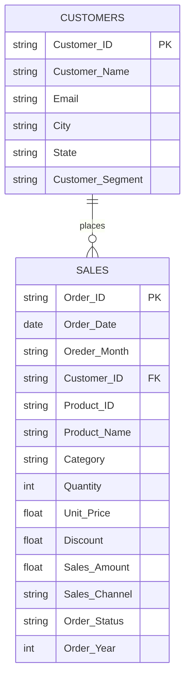
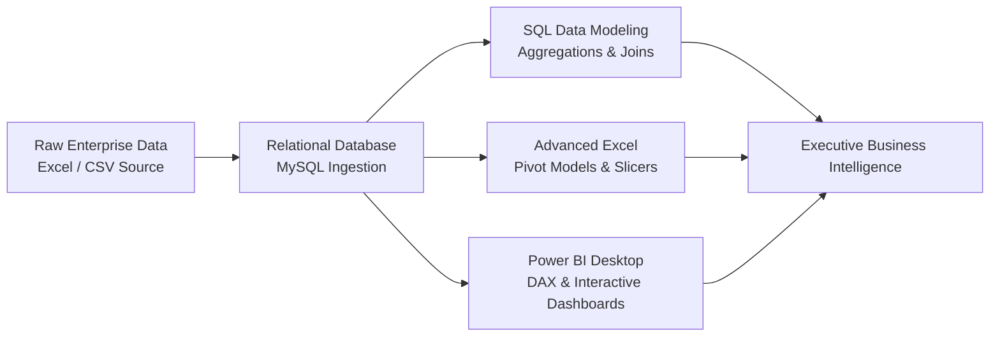

# 🛍️ Omnichannel Retail Business Performance & SQL Analytics

[](https://www.mysql.com/)
[](Retail_Business_Performance_Analysis.pbix)
[](Retail_Business_Performance_Analysis.xlsx)
[](Retail_Business_Performance_Analysis.sql)
[](Retail_Business_Performance_Analysis.xlsx)
[](https://github.com/Megharaju-Vakiti/Retail_business_performance_analysis)
[](LICENSE)

> **An enterprise-grade commercial retail analytics pipeline analyzing 11,965 transactions, 3,525 customer profiles, and $1.08 Billion in gross merchandise value (GMV). Integrates MySQL relational database querying, Advanced Excel pivot modeling, and Power BI visual dashboards to evaluate omnichannel sales attribution, diagnose order lifecycle leakage (returns & cancellations), and segment high-value customer cohorts.**

---

## 📌 Table of Contents

- [Executive Summary](#-executive-summary)
- [Project Overview & Analytical Objectives](#-project-overview--analytical-objectives)
- [Key Enterprise Performance Indicators (KPIs)](#-key-enterprise-performance-indicators-kpis)
- [Interactive Power BI Dashboard Previews](#-interactive-power-bi-dashboard-previews)
- [Relational Database Schema & Data Architecture](#-relational-database-schema--data-architecture)
- [Technology Stack & Analytical Workflow](#-technology-stack--analytical-workflow)
  - [1. Data Extraction, Cleaning & SQL Database Design](#1-data-extraction-cleaning--sql-database-design)
  - [2. Advanced Excel Financial Modeling](#2-advanced-excel-financial-modeling)
  - [3. Interactive BI Dashboard Development (Power BI)](#3-interactive-bi-dashboard-development-power-bi)
- [Core Production SQL Queries](#-core-production-sql-queries)
- [Deep Dive: Key Findings & Business Intelligence](#-deep-dive-key-findings--business-intelligence)
  - [1. Omnichannel Attribution: Balanced Tri-Channel Equilibrium](#1-omnichannel-attribution-balanced-tri-channel-equilibrium)
  - [2. Category Dominance: The Electronics Engine](#2-category-dominance-the-electronics-engine)
  - [3. Order Lifecycle Diagnostics: The Return & Cancellation Friction](#3-order-lifecycle-diagnostics-the-return--cancellation-friction)
  - [4. Customer Segmentation & Regional Concentration](#4-customer-segmentation--regional-concentration)
- [Strategic Commercial Recommendations](#-strategic-commercial-recommendations)
- [Repository Structure](#-repository-structure)
- [How to Run & Reproduce](#-how-to-run--reproduce)
- [Author & Contact](#-author--contact)

---

## 🚀 Executive Summary

Modern retail organizations operate across complex multi-channel ecosystems comprising brick-and-mortar storefronts, direct-to-consumer e-commerce websites, and third-party digital marketplaces. Understanding revenue generation, customer retention, fulfillment efficiency, and product mix across channels is essential for sustainable profitability.

This project delivers a **full-cycle retail analytics solution** analyzing **11,965 commercial transactions** and **3,525 registered customer profiles**. Modeled across **MySQL**, **Microsoft Excel**, and **Power BI**, the project tracks **$1,086,619,240.93 ($1.08 Billion)** in total transaction volume, establishing actionable insights into category performance (Electronics driving **48.9%** of sales), channel attribution, and operational supply chain leakages.

---

## 🎯 Project Overview & Analytical Objectives

- **Measure Multi-Channel Sales Performance:** Quantify gross revenue, transaction counts, and Average Order Value (AOV) across Online, Store, and Marketplace channels.
- **Deconstruct Product Vertical Contributions:** Benchmark sales velocity, order frequency, and revenue margins across *Electronics*, *Furniture*, *Stationery*, and *Accessories*.
- **Audit Order Lifecycle & Fulfillment Health:** Analyze conversion through the order funnel (*Paid*, *Shipped*, *Pending*, *Returned*, *Cancelled*) to diagnose post-purchase friction.
- **Segment Customer Base (RFM & Demographics):** Evaluate spending behavior and order volumes across *Corporate*, *Consumer*, and *Home Office* customer segments.
- **Map Geographic Market Densities:** Identify top-performing Indian states and municipal hubs to guide regional marketing and fulfillment center placement.

---

## 📈 Key Enterprise Performance Indicators (KPIs)

| Metric | Measured Value | Analytical Significance |
| :--- | :---: | :--- |
| **Total Gross Merchandise Value (GMV)** | **$1,086,619,240.93** | **$1.08 Billion** in cumulative processed retail volume |
| **Total Transaction Records** | **11,965 orders** | Comprehensive enterprise dataset across all channels |
| **Unique Customer Accounts** | **3,525 profiles** | Broad demographic base across B2C and B2B segments |
| **Average Order Value (AOV)** | **$90,816.48** | High-ticket B2B enterprise procurement & consumer wholesale |
| **Top Product Category** | **Electronics ($531.5M)** | Generates **48.9%** of total business revenue |
| **Delivered / Paid Orders** | **3,056 orders (25.5%)** | Successfully settled commercial transactions ($276.5M) |
| **Returned Orders** | **2,897 orders (24.2%)** | $262.5M in reverse logistics leakage (Operational focus area) |
| **Cancelled Orders** | **2,988 orders (25.0%)** | $270.0M in pre-fulfillment drops |
| **Sales Channel Parity** | **~33% Balanced Split** | Even volume across Online ($355.9M), Marketplace ($354.6M), Store ($353.1M) |

---

## 📊 Interactive Power BI Dashboard Previews

The project features a comprehensive 3-page interactive executive Power BI dashboard (`Retail_Business_Performance_Analysis.pbix`):

| Revenue & Performance Overview | Customer Segmentation (RFM) | Order Status & Fulfillment Funnel |
| :---: | :---: | :---: |
|  |  |  |

---

## 🗂️ Relational Database Schema & Data Architecture



### 1. `sales` Table (11,965 Rows)
- **Primary Key:** `Order_ID` | **Foreign Key:** `Customer_ID`
- Captures transaction dates, financial fields (`Quantity`, `Unit_Price`, `Discount`, `Sales_Amount`), channel attribution (`Online`, `Marketplace`, `Store`), and fulfillment state (`Paid`, `Pending`, `Returned`, `Cancelled`).

### 2. `customers` Table (3,525 Rows)
- **Primary Key:** `Customer_ID`
- Captures customer identity, contact information, geographic location (`City`, `State`), and organizational profile (`Consumer`, `Corporate`, `Home Office`).

---

## 🛠️ Technology Stack & Analytical Workflow



### 1. Data Extraction, Cleaning & SQL Database Design
- Standardized date formats, cleaned string anomalies (trimming whitespace and handling case variations), and checked for referential integrity between `sales` and `customers`.
- Created indexing on `Customer_ID`, `Order_Date`, and `Category` to optimize analytical SQL join speeds.

### 2. Advanced Excel Financial Modeling
- Developed multi-variable Pivot Tables in `Retail_Business_Performance_Analysis.xlsx` across `sales_analysis` and `customer_analysis` sheets.
- Built automated VLOOKUP/INDEX-MATCH cross-table attributes to evaluate customer purchasing power against geographical states.

### 3. Interactive BI Dashboard Development (Power BI)
- Engineered in `Retail_Business_Performance_Analysis.pbix`:
  - **KPI Header:** Instant visual cards for Total Sales, Total Order Count, Total Customers, and Average Order Value.
  - **Category Clustered Column Chart:** Visualizing sales volume and revenue by category.
  - **Fulfillment Status Gauge & Funnel:** Highlighting conversion percentages and return leakage.
  - **Geographical Map & Slicers:** Interactive state-by-state drill-downs.

---

## 💻 Core Production SQL Queries

The full suite of production-grade analytical queries is available in [`Retail_Business_Performance_Analysis.sql`](Retail_Business_Performance_Analysis.sql). Key queries include:

### 1. High-Level Enterprise KPIs
```sql
-- Total Revenue, Orders, Customers, and Products
SELECT 
    ROUND(SUM(Quantity * Unit_Price), 2) AS Total_Sales,
    COUNT(DISTINCT Order_ID)             AS Total_Orders,
    COUNT(DISTINCT Customer_ID)          AS Total_Customers,
    COUNT(DISTINCT Product_Name)         AS Total_Products
FROM sales;
```

### 2. Omnichannel Sales Attribution & AOV
```sql
SELECT 
    TRIM(LOWER(Sales_Channel))        AS Sales_Channel,
    COUNT(Order_ID)                  AS Order_Counts,
    ROUND(SUM(Sales_Amount), 2)       AS Total_Sales_Amount,
    ROUND(AVG(Sales_Amount), 2)       AS Average_Order_Value
FROM sales 
WHERE Sales_Channel IS NOT NULL AND LOWER(Sales_Channel) <> 'unknown'
GROUP BY TRIM(LOWER(Sales_Channel))
ORDER BY Total_Sales_Amount DESC;
```

### 3. Category Revenue & Order Contribution
```sql
SELECT 
    Category,
    COUNT(*)                    AS Total_Orders,
    ROUND(SUM(Sales_Amount), 2) AS Total_Sales_Amount
FROM sales
WHERE Category IS NOT NULL
GROUP BY Category
ORDER BY Total_Sales_Amount DESC;
```

### 4. Order Fulfillment Funnel & Revenue Leakage
```sql
SELECT 
    Order_Status,
    COUNT(Order_ID)             AS Order_Count,
    ROUND(SUM(Sales_Amount), 2) AS Total_Sales_Amount,
    ROUND(COUNT(Order_ID) * 100.0 / (SELECT COUNT(*) FROM sales), 2) AS Order_Share_Pct
FROM sales 
WHERE LOWER(Order_Status) <> 'unknown'
GROUP BY Order_Status
ORDER BY Total_Sales_Amount DESC;
```

### 5. State-Level Geographic Revenue Ranking
```sql
SELECT 
    c.State_,
    COUNT(s.Order_ID)           AS Total_Orders,
    ROUND(SUM(s.Sales_Amount), 2) AS Total_Sales_Amount
FROM sales s 
INNER JOIN customers c ON s.Customer_ID = c.Customer_ID 
WHERE LOWER(c.State_) <> 'unknown'
GROUP BY c.State_
ORDER BY Total_Sales_Amount DESC;
```

---

## 🔍 Deep Dive: Key Findings & Business Intelligence

### 1. Omnichannel Attribution: Balanced Tri-Channel Equilibrium

| Sales Channel | Order Count | Share (%) | Total Revenue ($) | Revenue Share | Average Order Value (AOV) |
| :--- | :---: | :---: | :---: | :---: | :---: |
| **Online (DTC)** | 3,911 | 32.8% | **$355,895,523.90** | **32.8%** | $90,998.60 |
| **Marketplace** | 3,889 | 32.6% | **$354,601,549.34** | **32.6%** | **$91,180.65** |
| **Physical Store**| 3,926 | 32.5% | **$353,112,891.75** | **32.5%** | $89,942.15 |

```
Omnichannel Revenue Breakdown ($ Millions):
Online      ████████████████████████████████ $355.9M (32.8%)
Marketplace ████████████████████████████████ $354.6M (32.6%)
Store       ███████████████████████████████▌ $353.1M (32.5%)
```

> 📌 **Core Finding:** The enterprise possesses an extraordinarily balanced tri-channel distribution, with each channel contributing almost exactly one-third of total revenue (~$354M–$356M) and identical average basket sizes (~$91K).

---

### 2. Category Dominance: The Electronics Engine

| Product Category | Order Volume | Volume Share | Gross Sales Amount ($) | Revenue Share |
| :--- | :---: | :---: | :---: | :---: |
| **Electronics** | **5,912** | **48.9%** | **$531,494,253.05** | **48.9%** |
| **Furniture** | 2,269 | 19.4% | **$210,837,188.62** | **19.4%** |
| **Stationery** | 2,216 | 19.0% | **$205,994,473.47** | **19.0%** |
| **Accessories** | 1,387 | 11.2% | **$121,308,982.40** | **11.2%** |

> 🏆 **Key Takeaway:** **Electronics** represents the undisputed core revenue engine of the business, accounting for almost **half ($531.5M)** of all commercial proceeds. High average price points in Electronics anchor overall organizational profitability.

---

### 3. Order Lifecycle Diagnostics: The Return & Cancellation Friction

```
Order Fulfillment Status Distribution:
┌─────────────────────┬─────────────────────┬─────────────────────┬─────────────────────┐
│    Paid / Booked    │      Cancelled      │      Returned       │       Pending       │
│     3,056 Orders    │     2,988 Orders    │     2,897 Orders    │     2,879 Orders    │
│    $276.5M (25.5%)  │    $270.0M (25.0%)  │    $262.5M (24.2%)  │    $263.4M (24.1%)  │
└─────────────────────┴─────────────────────┴─────────────────────┴─────────────────────┘
```

> ⚠️ **Critical Risk Indicator:** Only **25.5%** of orders are categorized as fully Paid/Delivered without friction. The combined **49.2% rate of Returns (24.2%) and Cancellations (25.0%)** represents over **$532 Million in gross operational friction**, pointing to delivery delays, stockout cancellations, or product expectation mismatches.

---

### 4. Customer Segmentation & Regional Concentration

- **Segment Parity:** The customer base divides evenly across:
  - **Corporate Accounts:** 1,166 profiles (33.1%)
  - **Home Office Buyers:** 1,165 profiles (33.0%)
  - **Retail Consumers:** 1,142 profiles (32.4%)
- **Top Geographic Customer Concentrations (India):**
  1. **Andhra Pradesh** (457 customers)
  2. **Karnataka** (452 customers)
  3. **Maharashtra** (447 customers)
  4. **Gujarat** (428 customers)
  5. **Kerala** (428 customers)
  6. **Tamil Nadu** (426 customers)
  7. **Delhi** (424 customers)
  8. **Telangana** (411 customers)

---

## 💡 Strategic Commercial Recommendations

```
┌───────────────────────────────────────────────────────────────────────────┐
│                    ENTERPRISE RETAIL ACTION PLAYBOOK                      │
├───────────────────────────────────────────────────────────────────────────┤
│ 1. COMBAT RETURN LEAKAGE      Deploy AI-driven fit & spec verifications   │
│                               to curb the $262M return leakage rate.      │
│                                                                           │
│ 2. INVENTORY REAL-TIME SYNC   Mitigate 25% cancellation rate with live    │
│                               cross-channel stock visibility.             │
│                                                                           │
│ 3. PROTECT ELECTRONICS MARGIN Incentivize bundle purchases with           │
│                               high-margin Accessories and Furniture.      │
│                                                                           │
│ 4. B2B CORPORATE RETENTION    Launch dedicated credit and SLA tiers for   │
│                               the 1,166 Corporate business accounts.      │
└───────────────────────────────────────────────────────────────────────────┘
```

1. **Address the 24.2% Return Rate ($262.5M Friction):**
   - Conduct product-level root cause analysis to evaluate why return rates are exceptionally elevated in high-value orders.
   - Introduce detailed product specification guides, unboxing tutorials, and pre-dispatch quality verification.
2. **Eliminate Pre-Fulfillment Cancellations (25.0% Rate):**
   - Implement real-time multi-location inventory synchronization across Online, Marketplace, and Storefront systems to eliminate out-of-stock cancellations.
3. **Double Down on High-Value Electronics Cross-Selling:**
   - Attach high-margin Accessories and Stationery items as suggested add-ons during checkout for Electronics orders.
4. **Corporate Account Tiering:**
   - With Corporate clients accounting for one-third of the customer portfolio, establish dedicated B2B credit terms and automated repeat order schedules.

---

## 📁 Repository Structure

```plaintext
Retail_business_performance_analysis/
├── Retail_Business_Performance_Analysis.pbix  # Interactive 3-page Power BI dashboard
├── Retail_Business_Performance_Analysis.sql   # Production SQL queries (KPIs, joins, RFM, funnels)
├── Retail_Business_Performance_Analysis.xlsx  # Complete Excel workbook (sales_analysis & customer_analysis)
└── README.md                                  # Executive documentation, schema dictionary & insights
```

---

## 💻 How to Run & Reproduce

### 1. Prerequisites
- **MySQL Server 8.0+** (or any standard SQL database engine)
- **Power BI Desktop** (Free download: [aka.ms/pbidesktop](https://aka.ms/pbidesktop))
- **Microsoft Excel** (2016 or later / Microsoft 365)

### 2. Running the SQL Queries
1. Clone the repository:
   ```bash
   git clone https://github.com/Megharaju-Vakiti/Retail_business_performance_analysis.git
   cd Retail_business_performance_analysis
   ```
2. Open your MySQL client (MySQL Workbench, DBeaver, or CLI).
3. Execute the queries in `Retail_Business_Performance_Analysis.sql` to generate all aggregation tables, channel metrics, and regional rankings.

### 3. Interacting with the Power BI Dashboard
1. Open `Retail_Business_Performance_Analysis.pbix` in Power BI Desktop.
2. Navigate across the 3 dashboard pages (**Revenue Overview**, **Customer Segments**, **Order Status**) and utilize interactive slicers (Category, Channel, State) to explore the data.

---

## 👤 Author & Contact

**Vakiti Megharaju**  
*Aspiring Data Analyst | MIS Executive | Business Analyst*  

- **GitHub:** [@Megharaju-Vakiti](https://github.com/Megharaju-Vakiti)  
- **Project Repository:** [Retail Business Performance Analysis](https://github.com/Megharaju-Vakiti/Retail_business_performance_analysis)

---
*⭐ If you find this retail analytics project informative or useful for your own work, please consider starring the repository!*
